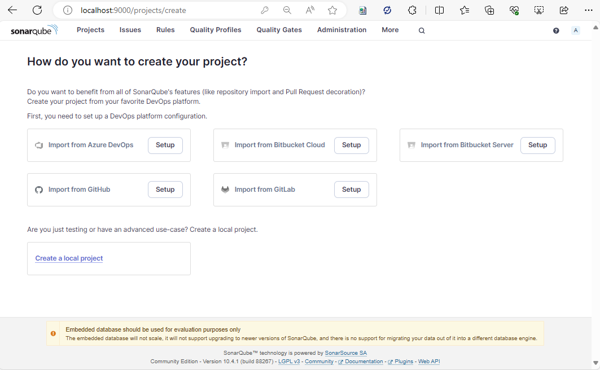
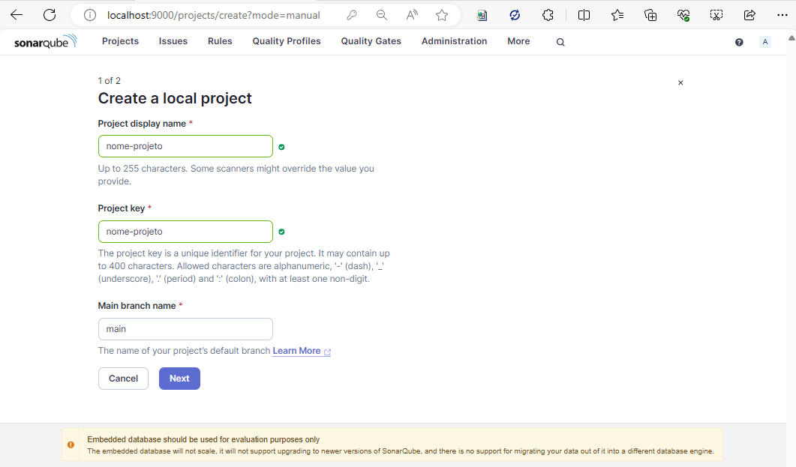
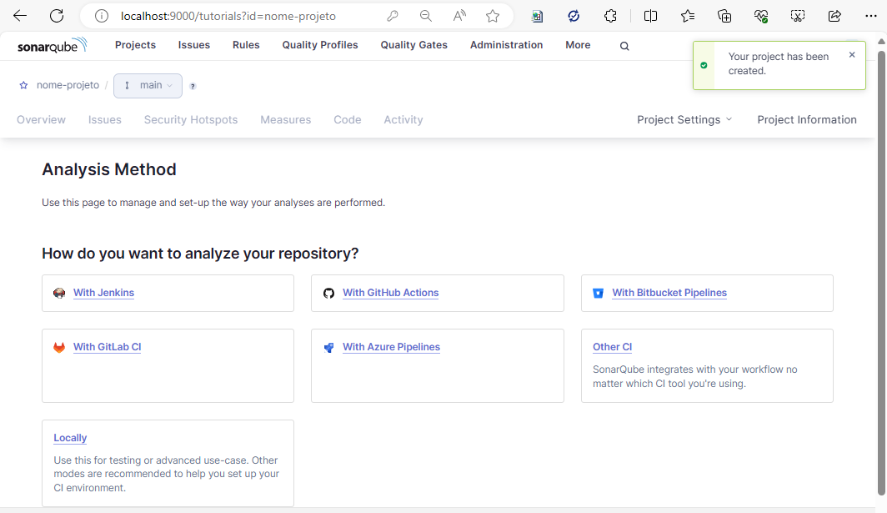
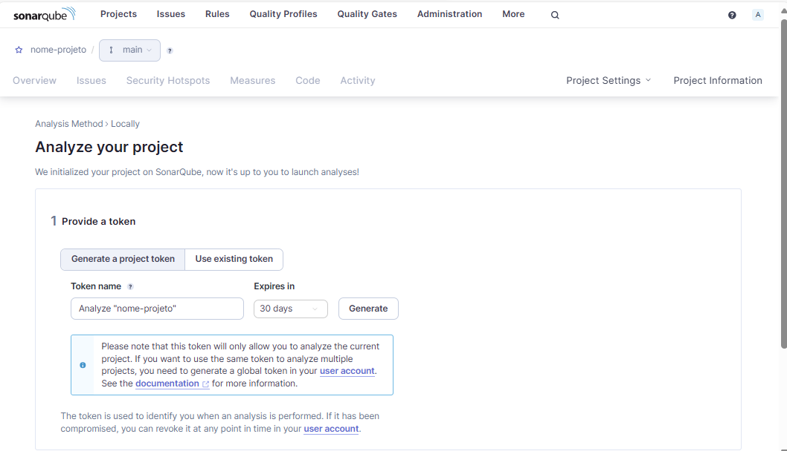
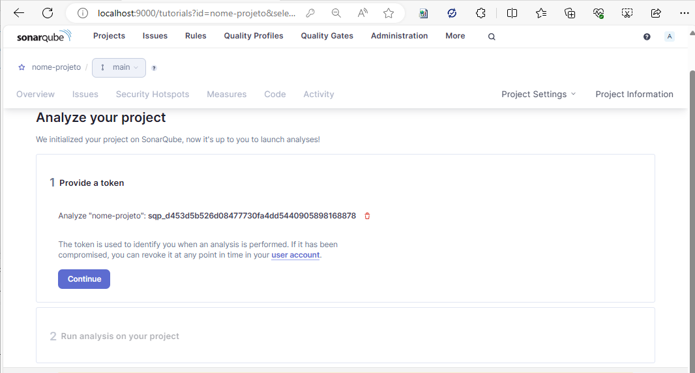

# README - Instruções para instalar e rodar SonarQube usando Docker


### Passo 1: Instalar Docker
Certifique-se de que o Docker está instalado e rodando em seu sistema. Se ainda não estiver instalado, siga as instruções de instalação disponíveis em [https://docs.docker.com/get-docker/](https://docs.docker.com/get-docker/).

### Passo 2: arquivo docker-compose.yml
Na pasta [raiz-projeto]/scripts/sonar-local, você encontrará um arquivo chamado `docker-compose.yml`.


### Passo 3: Rodar o Docker Compose
Abra o terminal, navegue até o diretório onde o arquivo `docker-compose.yml` está salvo e execute o comando abaixo para iniciar o SonarQube:

```
docker-compose up -d
```

Esse comando vai baixar a imagem do SonarQube e iniciar um container com base nas configurações especificadas no arquivo `docker-compose.yml`.

### Passo 4: Acessar o SonarQube
Após iniciar o container, você pode acessar a interface do SonarQube através do navegador, utilizando o seguinte endereço:

- **URL:** [http://localhost:9000](http://localhost:9000)

- **Usuário padrão:** admin
- **Senha padrão:** admin

### Passo 5: Parar o Container
Para parar o container, execute o seguinte comando:

```
docker-compose down
```

Isso encerrará o container e liberará os recursos utilizados.

## Instalar o SonarScanner e dotnet-coverage
Ainda no terminal:

1. Instalar o SonarScanner

```bash

  dotnet tool install --global dotnet-sonarscanner

```

2. Instalar o dotnet-coverage

```bash

  dotnet tool install --global dotnet-coverage

```
### Configurar um projeto no SonarQube

Apos a instalação do SonarQube, é necessário configurar um projeto para que o SonarQube possa validar a qualidade do seu código.

A premissa nesse documento é rodar o sonar local.

1. Na página inicial do SonarQube, clique em "**Create new project**"



2. Preencha as informações do projeto e clique em "**Next**"

> Coloque o nome do projeto em **Project display name**.



3. Escolha a configuração do seu projeto e clique em "**Create project**"

> geralmente escolhemos o **Use the global settings**, caso tenha dúvidas, consulte o time de Arquitetura.

4. Após a criação do projeto, é necessário escolher o Método de análise. Usaremos o **Locally**.



5. Precisamos criar um token-name e gerar um token para o projeto. Preencha um nome e clique em "**Generate**"



e clique em "**Continue**"



 6. Escolha a linguagem do seu projeto:

 > Nesse caso, escolheremos **C#** e **.NET Core**.

 

 > Note que ele apresenta os comando para rodar o sonar local.
 > Copie o arquivo  [raiz-projeto]/scripts/sonar.local.bat, para a raiz do projeto, e lá altere com as informações do seu projeto.

 Altere conforme abaixo:

```bash Bat do template
cls
Echo Iniciando o sonar 
dotnet sonarscanner begin /k:"[trocar-por-sonar-project-name]" /d:sonar.host.url="http://localhost:9000" /d:sonar.language="cs" /d:sonar.exclusions="**/*Development.json,**/bin/**/*,**/obj/**/*"  /d:sonar.token="[trocar-por-sonar-token]" /d:sonar.cs.vscoveragexml.reportsPaths=coverage.xml

dotnet restore

dotnet build --no-incremental
dotnet-coverage collect "dotnet test" -f xml -o "coverage.xml"

dotnet sonarscanner end /d:sonar.token="[trocar-por-sonar-token]"
Echo Finalizando o sonar, aperte qq tecla para continuar

pause

```

Onde **nome-projeto** é o nome do projeto criado no SonarQube e **[trocar-por-sonar-token]** é o token gerado.

Agora, execute o arquivo sonar.local.bat. e veja o resultado no SonarQube no navegador.

> para projetos em Macs ou linux, use o arquivo sonar.local.sh.
